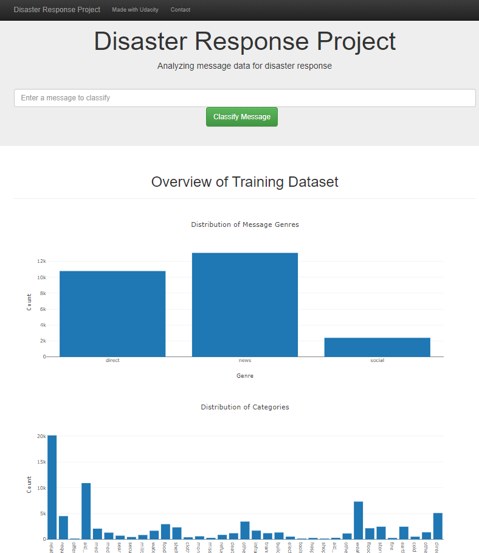

# Disaster Response Pipeline Project

### Summary
This project analyses disaster data from [Appen](https://www.appen.com/) (formerly Figure 8) to build a model for an API that classifies disaster messages.

The data set containing real messages that were sent during disaster events. I create a machine learning pipeline to categorize these events so that messages can be sent to an appropriate disaster relief agency.

The project includes a web app where an emergency worker can input a new message and get classification results in several categories. The web app also displays visualizations of the data.

## Files in Repository
 - Root Directory
    - app (files relating to the application, visualisations and new predictions from model)
        - templates
            - go.html
            - master.html
        - run.py
    - data (data files)
        - categories.csv
        - messages.csv
    - notebooks (notebooks used in developing the scripts plus db for testing these)
        - DisasterResponse.db
        - ETL Pipeline Preparation.ipynb
        - ML Pipeline Preparation. ipynb
    - classifier.pkl (model file)
    - DisasterResponse.db (sqlite database)
    - helicopter.jpg (image for readme)
    - process_data.py (ETL script)
    - README.md
    - Screenshot_app.png (sceenshot of app for readme)
    - train_classifier.py (classifier training script)

### Instructions:
1. Run the following commands in the project's root directory to set up your database and model.

    - To run ETL pipeline that cleans data and stores it in a sqlite database:
        
        `python process_data.py` (using defaults)
        
        `python process_data.py data/messages.csv data/categories.csv DisasterResponse.db` (full script)
    - To run ML pipeline that trains classifier and saves model:
        
        `python train_classifier.py` (using defaults)
        
        `python train_classifier.py DisasterResponse.db classifier.pkl`  (full script)

2. Go to `app` directory: `cd app`

3. Run your web app: `python run.py`

4. Click the `PREVIEW` button to open the homepage

Screenshot of app:

